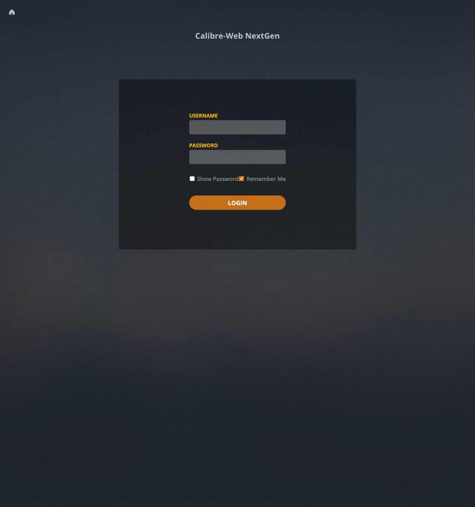
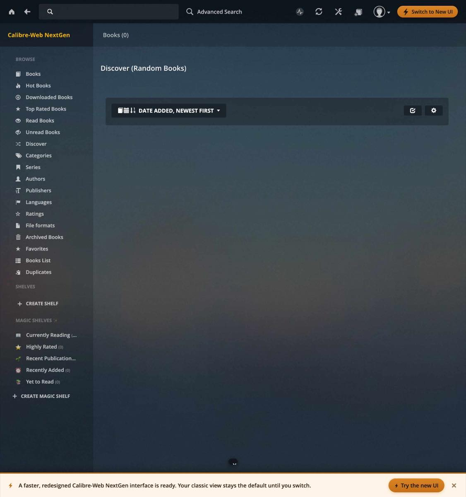
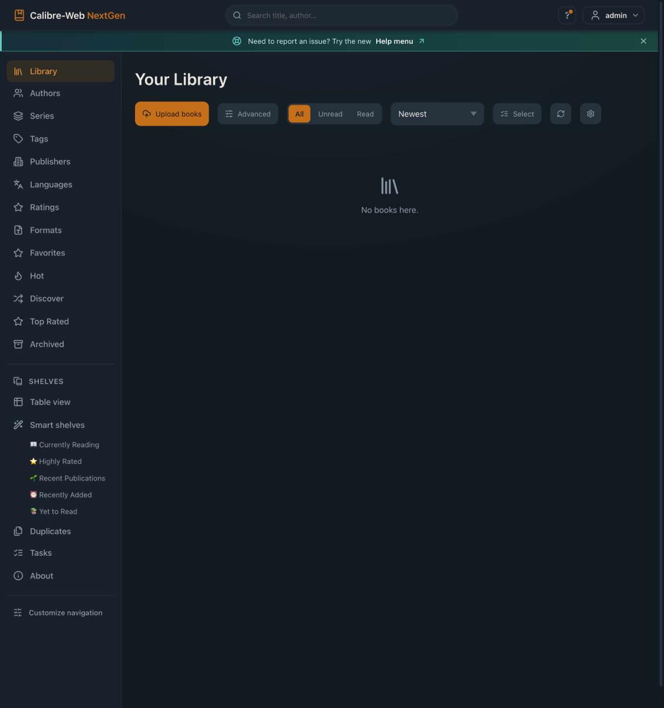

# Install / switch with `docker compose` (command line)

The baseline path, on any machine with Docker installed. **Your books, users, settings and
Read checkmarks live in the volumes you mount — not in the image — so switching keeps
everything and is reversible.**

## Fresh install

1. Create a folder and save the README's [canonical Docker Compose block](../../README.md#full-docker-compose-setup)
   as `docker-compose.yml`. That block is the single source of truth; adjust its volume paths,
   `PUID`/`PGID` (run `id` to see yours), and `TZ`.
2. Start it:

   ```bash
   docker compose up -d
   ```
3. Open `http://<host>:8083` and log in.

The screenshots below come from that exact flow on a real Docker host. The test used a fresh
empty volume set and host port `8105`; your normal URL will use the host port in your compose file.







## Switching from stock CWA

In your existing `docker-compose.yml`, change only the image line:

```diff
- image: crocodilestick/calibre-web-automated:latest
+ image: ghcr.io/new-usemame/calibre-web-nextgen:latest
```

Keep the same `volumes` (so `/config` and `/calibre-library` point at your existing data),
then:

```bash
docker compose pull
docker compose up -d
```

Your library, users and Read checkmarks carry over untouched. To roll back, change the image
line back and run the same two commands.

## Updating later

```bash
docker compose pull && docker compose up -d
```

`pull` fetches the newest `:latest` image; `up -d` recreates the container with your data
intact. (`restart` alone does **not** pull a new image.)

---

**Your setup might differ.** If a step doesn't match what you see, or if sync / auto-ingest
isn't working after you switch, we'll help you through it:

- **Open an issue** (best for tracking): https://github.com/new-usemame/Calibre-Web-NextGen/issues
- **Ask on Discord** (faster back-and-forth): https://discord.gg/B8NXZmcp32

Include your platform and what you ran, and we'll help you sort it out.
